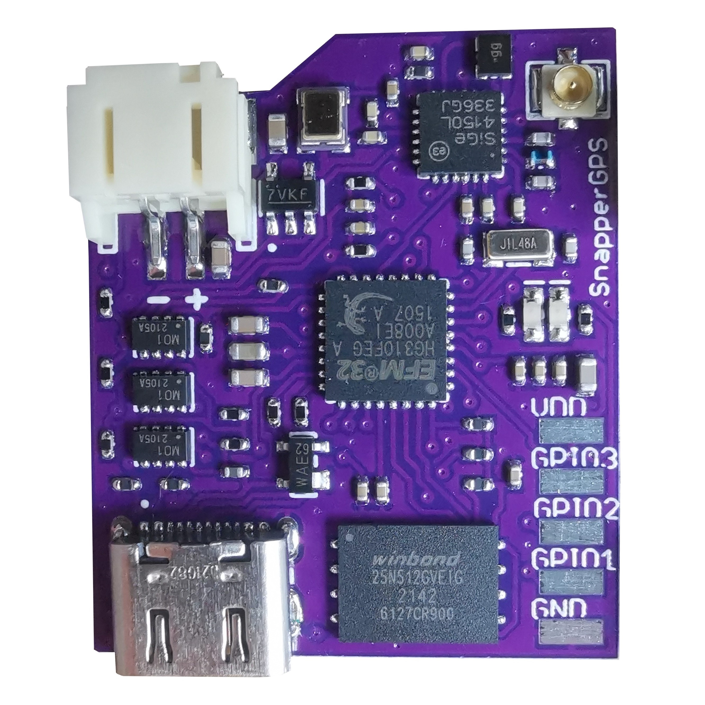
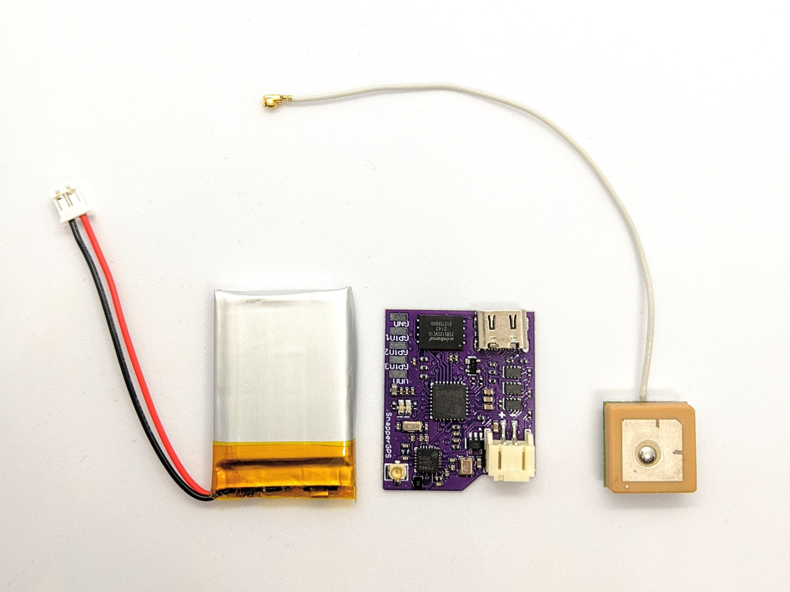
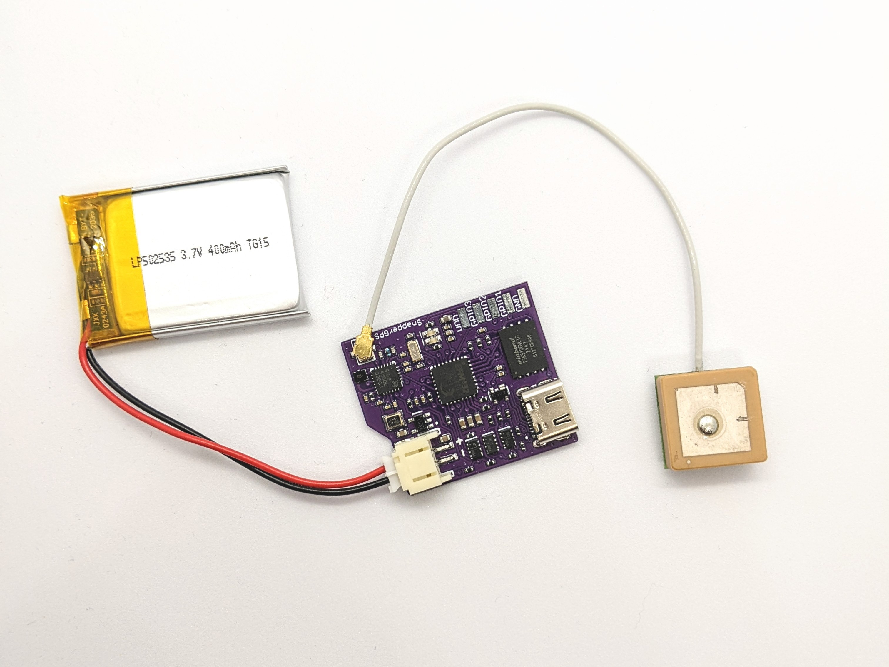
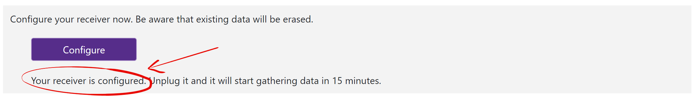

# SnapperGPS: Getting started

You just obtained your first SnapperGPS receiver or built one yourself? Here is how to get started with a quick test. If you face any problems on the way, check our troubleshooting section on [https://snappergps.info/](https://snappergps.info/) or ask a question [on GitHub](https://github.com/orgs/SnapperGPS/discussions).

## What is in the box?

SnapperGPS receivers come as assembled PCBs, but without any further protection or peripherals.

|  |
|:--:|
| *Figure 1: A bare-bone SnapperGPS receiver.* |

## What you need in addition.

To make your SnapperGPS receiver fully functional, you need the following items:
-	An active GPS-L1 antenna with [a U.FL/IPEX connector](https://en.wikipedia.org/wiki/Hirose_U.FL), for example, [an Echo 27](https://www.siretta.com/products/antennas/echo-27/) or [an Abracon APAM1368YB13V3.0](https://abracon.com/parametric/antennas/APAM1368YB13V3.0).
-	A lithium-ion polymer (LiPo) battery with a JST-PH connector to power your SnapperGPS receiver during a deployment, for example [this one with 40 mAh](https://www.sparkfun.com/products/13852) or [this one with 110 mAh](https://www.sparkfun.com/products/13853). Make sure that the polarity is correct by checking the +/- markings on the battery and the board.
-	Optionally, a charger for your LiPo battery, for example, [one from here](https://www.sparkfun.com/categories/421).
-	A USB-C cable to connect your SnapperGPS receiver to your laptop, desktop computer, phone, or tablet. This must be a data cable, not a power-only cable.

|  |
|:--:|
| *Figure 2: A SnapperGPS receiver, an Echo 27 antenna (right), and an 110 mAh lithium-ion polymer battery (left).* |

## How to assemble your tag.

Connect your active GPS-L1 antenna to the circular U.FL connector. Make sure that the connection is tight.

Next, connect your battery to the plastic JST connector of your SnapperGPS receiver. Make sure that the black cable is connected to the part of the connector that is labelled with “-” and the red cable to the one labelled with “+”. If the polarity is inverted, you may damage your SnapperGPS receiver.

Finally, connect a USB-C cable to the USB-C port of your SnapperGPS receiver.

|  |
|:--:|
| *Figure 3: A SnapperGPS receiver with peripherals.* |

## Connect to your SnapperGPS receiver.

Connect your SnapperGPS receiver via USB to your laptop, desktop computer, tablet, or phone. (Note: iOS and iPadOS are not supported.)

Go to [https://snappergps.info/](https://snappergps.info/) in a browser like Microsoft Edge or Google Chrome. (Note: Mozilla Firefox and Apple Safari are not supported, for example.)

Click on “Configure” and then on “Pair Receiver”. If your SnapperGPS receiver is connected via USB, you should see it in a pop-up and should be able to select it.

|  |
|:--:|
| *Figure 4: Home page of https://snappergps.info/.* |

|  |
|:--:|
| *Figure 5: Configure page before pairing a SnapperGPS receiver.* |

## Check the battery voltage.

If you successfully connected your SnapperGPS receiver to the web app, then you should see information about your SnapperGPS receiver on the top of the website. Check that the battery is charged, i.e., the battery voltage is around 4.1 V. If the battery is not charged, do so first before you continue.

|  |
|:--:|
| *Figure 6: Configure page showing battery voltage.* |

## Configure your SnapperGPS receiver.

Follow the steps on the same page of the web app to configure your SnapperGPS receiver for a test deployment. As start and end time, just select a short time period in the near future.

Check that the text below the “Configure” button reads “Your receiver is configured.”

Unplug your SnapperGPS receiver from USB. Immediately, the green LED should flash several times. If it does not flash or the red LED flashes, then your SnapperGPS receiver is not configured.

|  |
|:--:|
| *Figure 7: Configure page after configuring a SnapperGPS receiver.* |

## Record some data.

Move your SnapperGPS receivers outside. Place it in a way that the antenna points upwards towards the sky.

When your SnapperGPS receiver has not started to record data, then both LEDs will jointly flash in a regular interval. Once it has started to record data, the green LED will flash whenever it captures data. After all data has been recorded, the red LED will flash several times. However, you do not need to wait until this happens.

|  |
|:--:|
| *Figure 8: SnapperGPS receivers recording data.* |

## Upload your data.

Connect you SnapperGPS receiver again via USB and go to the Upload page of [https://snappergps.info/](https://snappergps.info/). Follow the instructions there to upload your raw data to our server.

Once your data has been processed, you should be able to see the final computed track on the download page.

|  |
|:--:|
| *Figure 9: Home page of https://snappergps.info/.* |

|  |
|:--:|
| *Figure 10: A SnapperGPS receiver with its recorded track.* |

## Further resources.

If you want to post-process your data, for example, smooth it to get better accuracy or plot it on an interactive map, and you have a little bit familiarity with the Python programming language, then you can find some scripts in [this repository](https://github.com/SnapperGPS/snappergps-scripts).

If you want to build a housing for your SnapperGPS receiver, then you can find some inspiration in [this repository](https://github.com/SnapperGPS/snappergps-housings). Potential housings include vacuum sealing, heat shrinking, milled plastic, or 3D printing. Make sure that the chosen method is suitable for your deployment environment.

Your SnapperGPS receiver exposes three general-purpose input-output (GPIO) pins that you can use to connect an external sensor or a trigger. Check out [the PCB design](https://github.com/SnapperGPS/snappergps-pcb) and [the firmware](https://github.com/SnapperGPS/snappergps-firmware) to learn more about this possibility.
