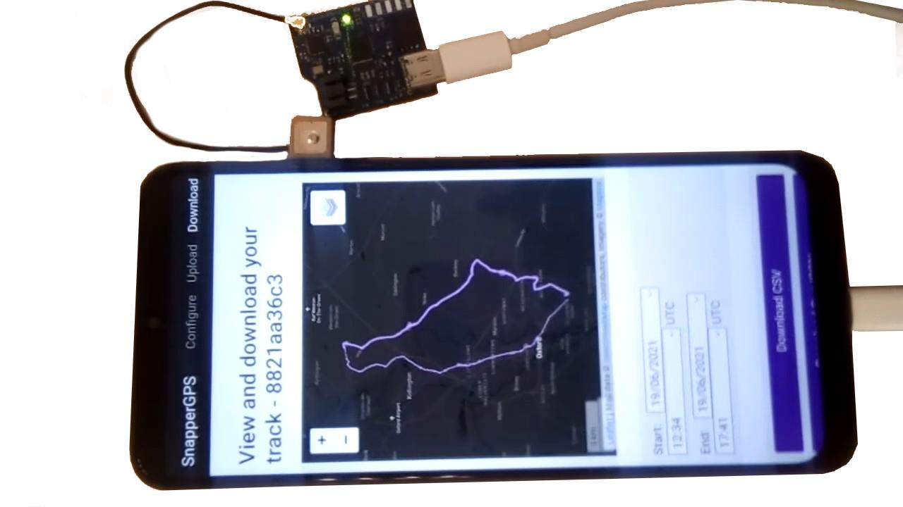

> *Are you looking for the open-source SnapperGPS hardware design files? You can find the files for the original version V1.0.0 in this repository and the files for an updated version V2.0.0 [in another repository](https://github.com/SnapperGPS/snappergps-pcb-2). For differences between both versions, please refer to the documentation over there. Jonas, May 2023*

# snappergps-pcb

The SnapperGPS receiver is a small, low-cost, and low-power GNSS receiver for non-real-time wildlife tracking. It employs the snapshot GNSS technology, which offloads the computationally expensive data processing to the cloud, and:

* Measures 32.0 mm x 27.3 mm,

* Operates for more than a year on a tiny 40 mAh battery,

* Has enough memory to provide almost 11,000 position fixes,

* Captures fixes in user-defined time intervals or externally triggered,

* Needs only 12 ms of signal reception for a fix,

* Employs multiple satellite systems for high reliability (GPS, Galileo, and BeiDou),

* Achieves a median real-world tracking accuracy of about 12 m (before smoothing),

* Maintains a real-time clock to accurately timestamp the fixes,

* Measures the temperature in addition, and

* Is configured via USB in your browser without the need to install a driver or an app.

This repository contains the hardware design files that can be used to replicate a SnapperGPS receiver.

If you use SnapperGPS hardware or software for research, please consider citing our publications.

For the hardware:

> Jonas Beuchert, Amanda Matthes, and Alex Rogers. 2022. SnapperGPS: Open Hardware for Energy-Efficient, Low-Cost Wildlife Location Tracking with Snapshot GNSS. Journal of Open Hardware, 7(1), p.2. https://doi.org/10.5334/joh.48.

For the cloud-processing software:

> Jonas Beuchert and Alex Rogers. 2021. SnapperGPS: Algorithms for Energy-Efficient Low-Cost Location Estimation Using GNSS Signal Snapshots. In SenSys ’21: ACM Conference on Embedded Networked Sensor Systems, November, 2021, Coimbra, Portugal. ACM, New York, NY, USA, 13 pages. https://doi.org/10.1145/3485730.3485931.

**Table of Contents**

1. [Workflow](#workflow)

2. [Getting started](#getting-started)

3. [Repository Structure](#repository-structure)

4. [Professional Manufacturing](#professional-manufacturing)

5. [Hand Assembly](#hand-assembly)

6. [Testing](#testing)

7. [Hardware Overview](#hardware-overview)

8. [Pinout](#pinout)

9. [Bill of Materials](#bill-of-materials)

10. [Additional Resources](#additional-resources)

11. [Acknowledgements](#acknowledgements)

## Workflow

- Get/build your SnapperGPS receiver (see sections below).
- [Configure](https://snappergps.info/configure) your SnapperGPS receiver in your browser for your deployment.
- Deploy your SnapperGPS receiver.
- The SnapperGPS receiver captures GNSS snapshots according to your configuration.
- Recover your SnapperGPS receiver.
- [Upload](https://snappergps.info/upload) the data from your SnapperGPS receiver to our server.
- [Download](https://snappergps.info/view) the track of your surveilled animal.

## Getting started

You already have a SnapperGPS receiver? See [here](GETTING-STARTED.md) how to get started.

You need to build one first? Keep reading.

## Repository Structure

The two files `.brd` and `.sch` are CAD files that contain the PCB's board design and schematic, respectively. They have been created with Autodesk EAGLE 9.6.2, but should be compatible with other electronic design software.

The table `.csv` contains the bill of materials (BOM).

The directory `CAMOutputs` includes the Gerber files and drill file, which are necessary for PCB manufacturing.

The two files `.mnb` and `.mnt` can be used for a pick-and-place machine and describe the component positions and orientations on the bottom and top layer, respectively.

## Professional Manufacturing

The simplest way to replicate SnapperGPS is to upload the BOM, the Gerber files, the drill file, and the pick and place files to an online PCB manufacturing and assembly service. They will source the components, print the PCB, and assemble the board.

We recommend a thickness between 0.8 and 1.6 mm for the two-layered board. The substrate can be FR-4 and hot air solder levelling (HASL) or electroless nickel immersion gold (ENIG) can be used for the finish.

## Hand Assembly

An alternative to prefessional manufacturing is to just obtain the SnapperGPS PCB from a PCB manufacturer and to manually assembly the board.
Hand-soldering a board takes less than 2 h for a skilled person, but requires intermediate equipment and skills and potentially additional time for testing, debugging, and re-work.

A laser-cut stencil for applying the solder paste can be helpful and can often be ordered together with the PCB.
In addition, the following materials and equipment are required:

* Soldering paste

* Syringe

* Spatula

* Tweezers

* Hot plate, re-flow oven, or hot air gun

* Flux pen (optional, for re-work)

* Multi-meter (optional, for debugging)

Proceed with the following steps to assemble a SnapperGPS PCB:

* Rigidly fix the PCB to a surface with the top layer pointing up.

* Fix the stencil on the PCB.

* Use the syringe to apply solder paste to the stencil.

* Use the spatula to distribute the solder paste such that all pads on the PCB are covered.

* Remove the stencil.

* Check that all pads are covered with solder paste.

* If not, manually apply solder paste.

* Use tweezers to place the components on the PCB.

* Heat the PCB following the re-flow profile of the used solder paste.

* Test the PCB (see below).

* If it does not work, identify problematic PCB sections and re-work, e.g., by applying flux and re-flowing the board. The most common issues are shorts and missing solder paste on some pads, which can be identified by using a multi-meter for continuity testing, but it is also possible that a component is placed incorrectly.

|  | 
|:--:| 
| *Figure 1: Several SnapperGPS PCBs ready for hand assembly.* |

|  | 
|:--:| 
| *Figure 2: A stencil on top of a SnapperGPS PCB with solder paste applied to it.* |

|  | 
|:--:| 
| *Figure 3: A SnapperGPS PCB with solder paste and components on a hot plate while re-flowing.* |

|  | 
|:--:| 
| *Figure 4: An assembled SnapperGPS receiver.* |

|  | 
|:--:| 
| *Figure 5: Measuring the current consumption of an assembled SnapperGPS receiver (bottom left) with a multi-meter (right), a DC voltage source (centre), two jumper wires, and alligator clips.* |

|  | 
|:--:| 
| *Figure 6: Charging a 110 mAh lithium-ion polymer battery via USB with a *SparkFun LiPo Charger Basic*.* |

|  | 
|:--:| 
| *Figure 7: Testing a SnapperGPS receiver with the SnapperGPS app on an Android smartphone using a USB-C cable.* |

## Testing

If you replicated a SnapperGPS receiver yourself, you need to flash the SnapperGPS firmware first:

* Short the VDD pin and the SWCLK pin of the SnapperGPS receiver, e.g., with a paper clip.

* Connect the SnapperGPS receiver via a USB-C cable to a host computer.

* Download [the SnapperGPS firmware binary](https://github.com/SnapperGPS/snappergps-firmware/releases).

* Install [the AudioMoth Flash App](https://www.openacousticdevices.info/applications) **or** [the Silicon Labs Simplicity Commander](https://community.silabs.com/s/article/simplicity-commander).

* Use one of the two tools two flash the firmware binary to the SnapperGPS receiver.

* Remove the paper clip.

Now, you can continue with some basic testing:

* Open [the SnapperGPS web app](https://snappergps.info) in Microsoft Edge or Google Chrome or download it from [the Microsoft Store](https://apps.microsoft.com/store/detail/snappergps/9P9RPRS6LSMM) or [Google Play](https://play.google.com/store/apps/details?id=com.herokuapp.snapper_gps.twa). (Alternatively, you can also host the SnapperGPS web app yourself, as described in [the _snappergps-app_ repository](https://github.com/SnapperGPS/snappergps-app)).

* Go to the *Configure* page and click/tap on *Pair receiver*.

* The connected SnapperGPS receiver should now be selectable in a pop-up window.

* After pairing, confirm that the receiver information in the table on the top of the page is appropriate, including on-board time and firmware version. The snapshot count should be zero.

* Connect a LiPo battery to the SnapperGPS receiver, paying attention to the polarity markers on top of the PCB. Connect the black cable to the pin next to the *-* and the red cable to the pin next to the *+*.

* Check the measured battery voltage in the table at the top of the *Configure* page. We recommend charging the battery to at least 4.1 V before a long-term deployment.

* Connnect an active GNSS antenna of your choice via the U.FL connector to the SnapperGPS receiver.

* Select some configuration parameters in the app and click/tap on *Configure*.

* Disconnect the SnapperGPS receiver.

* Record a few snapshots outdoors.

* Reconnect the SnapperGPS receiver.

* Go to the *Upload* page and follow the instructions to upload the snapshots from the SnapperGPS receiver to the server. Please select only snapshots for processing that you collected outdoors.

* Once processing is complete, inspect the calculated track on the *Download* page. There are also links to some of our tracks for comparison.

Testing the localisation accuracy:

* Record some data outdoors at a location with known coordinates.

* Upload it via the SnapperGPS app.

* Calculate the horizontal error between the estimated locations and the ground truth.

* We obtained median errors of 10-12 m, depending on the scenario.

Measuring the power consumption:

* Configure a SnapperGPS receiver using the SnapperGPS app.

* Power the SnapperGPS receiver from an external DC source with 3.7-4.2 V.

* Place an ammeter in series with the source.

* The current should be 1-2 μA if the board is sleeping and the maximum current should be around 25 mA when capturing a snapshot. The charge consumption for a single snapshot should be <0.3 μAh.

Testing the flash memory:

* Record the maximum of 10901 snapshots.

* Transfer them to a host computer using the *Transfer data* button on the *Upload* page of the SnapperGPS web app.

* Ensure that all 10901 snapshots have been transferred and are provided as download.

## Hardware Overview

Please have a look at our [paper](https://doi.org/10.5334/joh.48).

## Pinout

We expose the three general-purpose input/output pins (GPIOs) PA0, PA1, and PA2 of the MCU as well as the supply voltage pin VDD and the ground pin GND at an edge of the PCB.
This allows to connect external modules to extend the functionality of the device.
This can be done by soldering wires on the rectangular pads.
For the functionality of the three pins, please refer to [the pinout section in the datasheet of the EFM32HG310](https://www.silabs.com/documents/public/data-sheets/efm32hg-datasheet.pdf#page=118).

We also expose the VDD, GND, RESET, SWCLK, and SWDIO pins of the MCU on the back of the PCB.
The last two ones allow for debugging or flashing using [Serial Wire Debug (SWD)](https://community.silabs.com/s/article/serial-wire-debug-swd-x).
All five circular pads have a spacing of 0.1 in and, hence, the same as common PCB headers.

All ten pads are labelled on the silkscreen of the PCB.

```
Front           │           │ Back
                │           │
                │           │ ○ GND
          VDD □ │           │
                │           │ ○ RESET
    GPIO3/PA2 □ │           │
                │           │ ○ SWCLK
    GPIO2/PA1 □ │           │
                │           │ ○ SWDIO
    GPIO1/PA0 □ │           │
                │           │ ○ VDD
          GND □ │           │
────────────────┘           │
```

## Bill of Materials

|Designator                                    |Qty|Manufacturer                  |Part #                                 |Description/Value                                            |Package/Footprint|Mounting Type|Notes                                                                          |Supplier URL                                                                                           |
|----------------------------------------------|--:|------------------------------|---------------------------------------|-------------------------------------------------------------|-----------------|-------------|-------------------------------------------------------------------------------|-------------------------------------------------------------------------------------------------------|
|C4, C8, C10, C12, C13, C14, C16, C17, C20, C23| 10|Murata                        |GRM155R60J104KA01D                     |Ceramic capacitor, 100 nF                                    |0402             |SMD          |                                                                               |https://www.digikey.com/en/products/detail/murata-electronics/GRM155R60J104KA01D/490-6287-1-ND/3845484 |
|C3, C5, C6, C7, C9                            |  5|Murata                        |GRM155R60J103KA01D                     |Ceramic capacitor, 10 nF                                     |0402             |SMD          |                                                                               |https://www.digikey.com/en/products/detail/murata-electronics/GRM155R60J103KA01D/490-6286-1-ND/3845483 |
|C2                                            |  1|Murata                        |GRM1555C1H101JA01J                     |Ceramic capacitor, 100 pF                                    |0402             |SMD          |                                                                               |https://www.digikey.com/en/products/detail/murata-electronics/GRM1555C1H101JA01J/490-7754-1-ND/4358006 |
|C1                                            |  1|Murata                        |GRM1555C1H220JA01D                     |Ceramic capacitor, 22 pF                                     |0402             |SMD          |                                                                               |https://www.digikey.com/en/products/detail/murata-electronics/GRM1555C1H220JA01D/490-5868-1-ND/3175200 |
|C21, C22                                      |  2|Murata                        |GRM1555C1H180JA01D                     |Ceramic capacitor, 18 pF                                     |0402             |SMD          |                                                                               |https://www.digikey.com/en/products/detail/murata-electronics/GRM1555C1H180JA01D/2854383               |
|C11, C19, C24, C25                            |  4|Murata                        |GRM188R60J105KA01D                     |Multi-layer ceramic capacitor, 1 uF, 6.3 V, X5R              |0603             |SMD          |                                                                               |https://www.digikey.com/en/products/detail/murata-electronics/GRM188R60J105KA01D/490-1550-1-ND/587755  |
|C18                                           |  1|Murata                        |GRM185R60J475ME15D                     |Multi-layer ceramic capacitor, 4.7 uF, 6.3 V, X5R            |0603             |SMD          |                                                                               |https://www.digikey.com/en/products/detail/murata-electronics/GRM185R60J475ME15D/490-3892-1-ND/965934  |
|C15                                           |  1|Murata                        |GRM188R60J106KE47D                     |Multi-layer ceramic capacitor, 10 uF, 6.3 V, X5R             |0603             |SMD          |                                                                               |https://www.digikey.com/en/products/detail/murata-electronics/GRM188R60J106KE47D/490-12538-1-ND/5797528|
|L1                                            |  1|Delta Electronics             |0402HS-390EKTS                        |Fixed inductor, 39 nH, 200 mA, 550 MOhm                      |0402             |SMD          |                                                                               |https://www.digikey.com/en/products/detail/0402HS-390EKTS/2035-0402HS-390EKTSCT-ND/10231211            |
|L2                                            |  1|Murata                        |BLM15HB221SH1D                         |Ferrite bead                                                 |0402             |SMD          |                                                                               |https://www.digikey.com/en/products/detail/murata-electronics/BLM15HB221SH1D/6798444                   |
|R11, R12                                      |  2|Yageo                         |RC0402FR-0715RL                        |Resistor, 15R                                                |0402             |SMD          |                                                                               |https://www.digikey.com/en/products/detail/yageo/RC0402FR-0715RL/311-15LRCT-ND/2827914                 |
|R15, R16                                      |  2|Yageo                         |RC0402FR-071KL                         |Resistor, 1K                                                 |0402             |SMD          |                                                                               |https://www.digikey.com/en/products/detail/yageo/RC0402FR-071KL/726513                                 |
|R10, R13, R17                                 |  3|Yageo                         |RC0402FR-074K7L                        |Resistor, 4K7                                                |0402             |SMD          |                                                                               |https://www.digikey.com/en/products/detail/yageo/RC0402FR-074K7L/311-4-7KLRCT-ND/2827881               |
|R7, R8                                        |  2|Yageo                         |RC0402FR-075K1L                        |Resistor, 5K1                                                |0402             |SMD          |                                                                               |https://www.digikey.com/en/products/detail/yageo/RC0402FR-075K1L/726624                                |
|R18                                           |  1|Yageo                         |RC0402FR-076K8L                        |Resistor, 6K8                                                |0402             |SMD          |                                                                               |https://www.digikey.com/en/products/detail/yageo/RC0402FR-076K8L/311-6-80KLRCT-ND/729589               |
|R14, R19                                      |  2|Yageo                         |RC0402FR-0710KL                        |Resistor, 10K                                                |0402             |SMD          |                                                                               |https://www.digikey.com/en/products/detail/yageo/RC0402FR-0710KL/726523                                |
|R1, R2, R3, R4, R5, R6, R9                    |  7|Yageo                         |RC0402FR-07100KL                       |Resistor, 100K                                               |0402             |SMD          |                                                                               |https://www.digikey.com/en/products/detail/yageo/RC0402FR-07100KL/311-100KLRCT-ND/729473               |
|Q2                                            |  1|Jauch Quartz                  |Q 0,032768-JTX310-12,5-10-T1-HMR-50K-LF|Crystal, 32.768 kHz ±10 ppm, 12.5 pF, 50 kOhm                |2-SMD            |SMD          |Possible substitutes: Epsom, X1A0001410004 FC-135R 32.768KHZ 9PF or Jauch Quartz, Q 0,032768-JTX310-12,5-10-T1-HMR-60K-LF|https://www.digikey.com/en/products/detail/jauch-quartz/Q-0-032768-JTX310-12-5-10-T1-HMR-50K-LF/8108077|
|D1                                            |  1|Rohm Semiconductor            |SML-D12M1WT86                          |LED, yellow-green, 572 nm, 2.2 V                             |0603             |SMD          |                                                                               |https://www.digikey.com/en/products/detail/rohm-semiconductor/SML-D12M1WT86/SML-D12M1WT86CT-ND/5843861 |
|D2                                            |  1|Rohm Semiconductor            |SML-D12U1WT86                          |LED, red, 620 nm, 2.2 V                                      |0603             |SMD          |                                                                               |https://www.digikey.com/en/products/detail/rohm-semiconductor/SML-D12U1WT86/SML-D12U1WT86CT-ND/5843858 |
|TCXO1                                         |  1|Connor Winfield               |D32G-016.368M                          |Temperature compensated oscillator, 16.384 MHz               |3.2x2.5          |SMD          |Possible substitutes: EPSON, X1G005441030112 or TXC Corporation, 7Q-16.368MBG-T|https://www.digikey.com/en/products/detail/connor-winfield/D32G-016-368M/3641696                       |
|U2                                            |  1|Skyworks Solutions Inc.       |SE4150L-R                              |RF receiver                                                  |24-QFN           |SMD          |                                                                               |https://www.digikey.com/en/products/detail/skyworks-solutions-inc/SE4150L-R/863-1354-1-ND/2745473      |
|SAW1                                          |  1|Abracon LLC                   |AFS20A42-1575.42-T3                    |SAW filter, 1.575 GHz, BW 42 MHz                             |4-SMD            |SMD          |                                                                               |https://www.digikey.com/en/products/detail/abracon-llc/AFS20A42-1575-42-T3/535-12069-1-ND/4075659      |
|U1                                            |  1|Silicon Labs                  |EFM32HG310F64G-C-QFN32R                |Microcontroller                                              |32-QFN           |SMD          |Possible substitutes: EFM32HG310F64G-A-QFN32R or EFM32HG310F64G-B-QFN32R       |https://www.digikey.com/en/products/detail/silicon-labs/EFM32HG310F64G-C-QFN32R/336-6165-1-ND/10314104 |
|U3                                            |  1|Nexperia                      |PRTR5V0U2AX,235                        |TVS diode, 5.5 V                                             |SOT143B          |SMD          |                                                                               |https://www.digikey.com/en/products/detail/nexperia-usa-inc/PRTR5V0U2AX235/1727-5862-1-ND/2698064      |
|IC1                                           |  1|Winbond Electronics           |W25N512GVEIG                           |NAND flash, 512 Mbit                                         |WSON-8           |SMD          |                                                                               |https://www.digikey.com/en/products/detail/W25N512GVEIG/256-W25N512GVEIG-ND/12143334                   |
|J3                                            |  1|TE Connectivity AMP Connectors|1909763-1                              |U.FL connector jack, 50 Ohm                                  |                 |SMD          |                                                                               |https://www.digikey.com/en/products/detail/1909763-1/A118077CT-ND/4729711                              |
|Q1, Q3, Q4                                    |  3|Rohm Semiconductor            |TT8M1TR                                |Mosfet array N and P-channel, 20 V, 2.5 A, 1 W               |8-SMD            |SMD          |                                                                               |https://www.digikey.com/en/products/detail/rohm-semiconductor/TT8M1TR/5042837                          |
|U4                                            |  1|ABLIC U.S.A. Inc.             |S-1318D33-M5T1U4                       |Linear voltage regulator IC, positive fixed, 1 output, 100 mA|SOT-23-5         |SMD          |                                                                               |https://www.digikey.com/en/products/detail/ablic-inc/S-1318D33-M5T1U4/10313979                         |
|J1                                            |  1|JAE Electronics               |DX07S016JA1R1500                       |USB-C receptacle connector, 24 Pins (16+8 dummy), right angle|                 |through-hole |                                                                               |https://www.digikey.com/en/products/detail/jae-electronics/DX07S016JA1R1500/11585731                   |
|J2                                            |  1|JST Sales America Inc.        |S2B-PH-SM4-TB                          |Connector header, right angle, 2 position, 2.00 mm           |                 |SMD          |                                                                               |https://www.digikey.com/en/products/detail/jst-sales-america-inc/S2B-PH-SM4-TB-LF-SN/926655            |
|                                              |   |                              |                                       |                                                             |                 |             |                                                                               |                                                                                                       |

The BOM differs slightly from the one for initial SnapperGPS test boards, which was only $14 in a batch of 100.
For example, we used cheaper TCXOs, the X1G005441030112 manufactured by EPSON or the 7Q-16.368MBG-T from the TXC Corporation, which cost around $2 instead of the expensive D32G-016.368M that costs $7-$8.
We had to introduce this change because of the on-going global supply chain disruptions and recommend to revert to one of the initial choices for replications, if possible, to reduce the overall cost.

## Additional resources

## Acknowledgements

SnapperGPS is developed by
[Jonas Beuchert](https://users.ox.ac.uk/~kell5462/),
[Amanda Matthes](https://amanda-matthes.github.io/), and
[Alex Rogers](https://www.cs.ox.ac.uk/people/alex.rogers/)
in the Department of Computer Science
of the University of Oxford.

Jonas Beuchert and Amanda Matthes are
funded by the EPSRC Centre for Doctoral Training in
Autonomous Intelligent Machines and Systems
(DFT00350-DF03.01, DFT00350-DF03.05) and develop
SnapperGPS as part of their doctoral studies.
The implementation of SnapperGPS 
was co-funded by an EPSRC IAA Technology Fund
(D4D00010-BL14).

[Amanda Matthes](https://github.com/amanda-matthes) owns the copyright of the current SnapperGPS logo/icon that is on the bottom layer silkscreen of the PCB.

##

This documentation is licensed under a
[Creative Commons Attribution 4.0 International License][cc-by].

[![CC BY 4.0][cc-by-image]][cc-by]

[cc-by]: http://creativecommons.org/licenses/by/4.0/
[cc-by-image]: https://i.creativecommons.org/l/by/4.0/88x31.png

SnapperGPS V1.0.0 is certified as open source hardware by the Open Source Hardware Association with UID [UK000044](https://certification.oshwa.org/uk000044.html).


